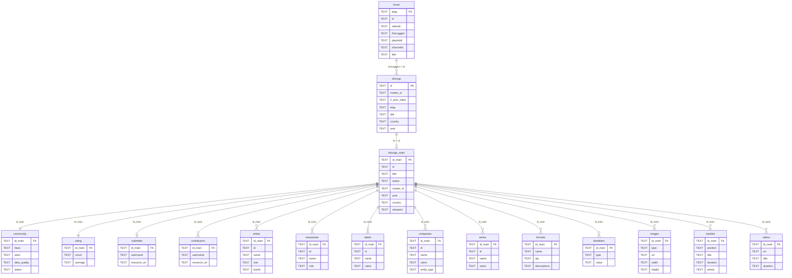

# Schéma de base de données (MPD)

```mermaid
erDiagram
    music {
        TEXT etag PK
        TEXT id
        TEXT videoId
        TEXT Discogged
        TEXT playlistId
        TEXT channelId
        TEXT title
    }

    discogs {
        TEXT id PK
        TEXT master_id
        TEXT Z_tech_index
        TEXT etag
        TEXT title
        TEXT country
        TEXT year
    }

    discogs_main {
        TEXT id_main PK
        TEXT id
        TEXT title
        TEXT status
        TEXT master_id
        TEXT year
        TEXT country
        TEXT released
    }

    community {
        TEXT id_main FK
        TEXT have
        TEXT want
        TEXT data_quality
        TEXT status
    }

    rating {
        TEXT id_main FK
        TEXT count
        TEXT average
    }

    submitter {
        TEXT id_main FK
        TEXT username
        TEXT resource_url
    }

    contributors {
        TEXT id_main FK
        TEXT username
        TEXT resource_url
    }

    artists {
        TEXT id_main FK
        TEXT id
        TEXT name
        TEXT role
        TEXT tracks
    }

    extraartists {
        TEXT id_main FK
        TEXT id
        TEXT name
        TEXT role
    }

    labels {
        TEXT id_main FK
        TEXT id
        TEXT name
        TEXT catno
    }

    companies {
        TEXT id_main FK
        TEXT id
        TEXT name
        TEXT catno
        TEXT entity_type
    }

    series {
        TEXT id_main FK
        TEXT id
        TEXT name
        TEXT catno
    }

    formats {
        TEXT id_main FK
        TEXT name
        TEXT qty
        TEXT descriptions
    }

    identifiers {
        TEXT id_main FK
        TEXT type
        TEXT value
    }

    images {
        TEXT id_main FK
        TEXT type
        TEXT uri
        TEXT width
        TEXT height
    }

    tracklist {
        TEXT id_main FK
        TEXT position
        TEXT title
        TEXT duration
        TEXT artists
    }

    videos {
        TEXT id_main FK
        TEXT uri
        TEXT title
        TEXT duration
    }

    music ||--o{ discogs : "Discogged -> id"
    discogs ||--o| discogs_main : "id -> id"
    discogs_main ||--|| community : "id_main"
    discogs_main ||--|| rating : "id_main"
    discogs_main ||--o| submitter : "id_main"
    discogs_main ||--o{ contributors : "id_main"
    discogs_main ||--o{ artists : "id_main"
    discogs_main ||--o{ extraartists : "id_main"
    discogs_main ||--o{ labels : "id_main"
    discogs_main ||--o{ companies : "id_main"
    discogs_main ||--o{ series : "id_main"
    discogs_main ||--o{ formats : "id_main"
    discogs_main ||--o{ identifiers : "id_main"
    discogs_main ||--o{ images : "id_main"
    discogs_main ||--o{ tracklist : "id_main"
    discogs_main ||--o{ videos : "id_main"
```