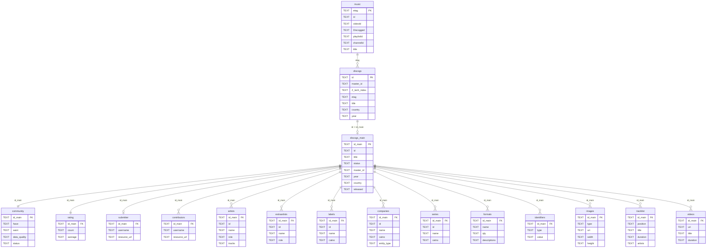

# data/ — Documentation technique

> Données de l'application : base SQLite, fichiers bruts, scripts SQL.

---

## Vue d'ensemble

Ce dossier contient toutes les données persistées de HOUSIFY ainsi que les scripts SQL de création et de transformation.

| Élément | Description |
|---|---|
| `housify.db` | Base SQLite principale (non versionné) |
| `MUSIC.csv` | Export CSV de la table `music` |
| `raw_data.json` | Données brutes JSON (import initial) |
| `raw_info/` | JSON de releases Discogs individuelles (cache local) |
| `sql/` | Scripts SQL organisés par type : création, vues, ETL |

---

## Structure SQL

### `sql/CREATE_TABLES/`

Scripts `CREATE TABLE` pour chaque table de la base. Générés automatiquement par `py_utils/extract_tables.py` à partir du schéma existant de `housify.db`.

| Script | Table | Rôle |
|---|---|---|
| `CREATE_TABLE_MUSIC.sql` | `music` | Vidéos YouTube (PK: `etag`) |
| `CREATE_TABLE_DISCOGS.sql` | `discogs` | Résultats de recherche Discogs (PK: `id`, `etag`) |
| `CREATE_TABLE_DISCOGS_MAIN.sql` | `discogs_main` | Détails complets d'une release Discogs |
| `CREATE_TABLE_ARTISTS.sql` | `artists` | Artistes liés à une release |
| `CREATE_TABLE_TRACKLIST.sql` | `tracklist` | Pistes d'une release |
| `CREATE_TABLE_RATING.sql` | `rating` | Notes communautaires Discogs |
| `CREATE_TABLE_COMMUNITY.sql` | `community` | Stats communautaires (have/want) |
| `CREATE_TABLE_FORMATS.sql` | `formats` | Formats physiques (vinyle, CD…) |
| `CREATE_TABLE_LABELS.sql` | `labels` | Labels / éditeurs |
| `CREATE_TABLE_COMPANIES.sql` | `companies` | Sociétés impliquées |
| `CREATE_TABLE_IMAGES.sql` | `images` | Pochettes et images |
| `CREATE_TABLE_VIDEOS.sql` | `videos` | Vidéos liées sur Discogs |
| `CREATE_TABLE_IDENTIFIERS.sql` | `identifiers` | Identifiants (barcode, etc.) |
| `CREATE_TABLE_SERIES.sql` | `series` | Séries de releases |
| `CREATE_TABLE_EXTRAARTISTS.sql` | `extraartists` | Artistes additionnels |
| `CREATE_TABLE_SUBMITTER.sql` | `submitter` | Soumetteur de la release |
| `CREATE_TABLE_CONTRIBUTORS.sql` | `contributors` | Contributeurs |

**Utilitaires Python** (`py_utils/`) :
- `extract_tables.py` : extrait les `CREATE TABLE` depuis le schéma SQLite et les écrit en fichiers `.sql`
- `get_schema.py` : affiche la structure complète de la base (tables, colonnes, clés)

### `sql/CREATE_VIEWS/`

| Script | Vue | Description |
|---|---|---|
| `CREATE_VIEW_MUSICDISG.sql` | `musicdisg` | Vue consolidée joignant `music`, `discogs`, `discogs_main` et `rating` — utilisée par l'interface web Music & Discogs |

### `sql/ETL_SCRIPTS/`

| Script | Description |
|---|---|
| `CONSOLIDATE.sql` | Requête de jointure `music × discogs × discogs_main × rating` (même logique que la vue `musicdisg`) |
| `EASY_EXECUTE.py` | Exécute `CONSOLIDATE.sql` et exporte le résultat en CSV (`output.csv`) |
| `GET_STRUCT.sql` | Requête d'introspection du schéma SQLite (tables + colonnes) |

---

## Schéma de base de données (MPD)

### Relations clés

| Source | Destination | Jointure |
|---|---|---|
| `music` | `discogs` | `music.etag = discogs.etag` |
| `discogs` | `discogs_main` | `discogs.id = discogs_main.id_main` |
| `discogs_main` | toutes les sous-tables | `discogs_main.id_main = *.id_main` |